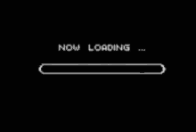
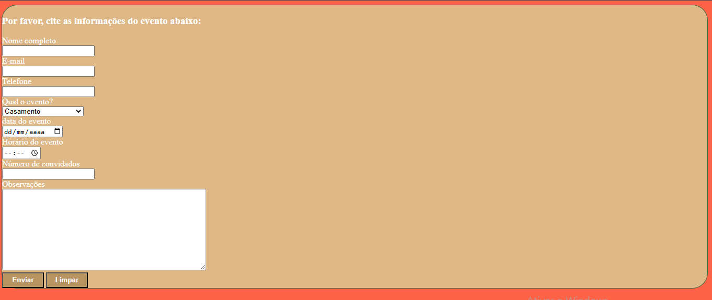
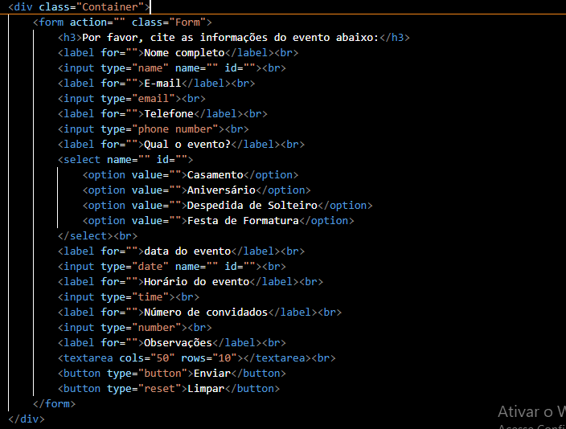
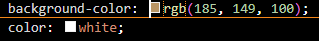
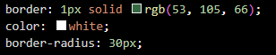

# Cad_event

<h1 align="center"></h1>

Projeto criado como parte avaliativa da disciplina de Fundamentos de Desenvolvimento Web ministrada pelo professor Leonardo Rocha.

## Índice

* [Descrição](#descrição)
* [Tecnologias](#tecnologias)
* [Referências](#referências)
* [Autor(a)](#autora)

### Descrição

O projeto envolve a criação de um formulário de cadastro de evento, onde o usuário pode inserir as informações do evento que quer realizar(tipo de vento, data, horário,etc.), podendo também limpar todas as informações se necessário.

### Resultado do Projeto

### Confecção

O projeto foi confeccionado, utilizando HTML5. Foi criado um arquivo index.html. Nesse arquivo, constam configurações apresentadas a seguir:

    * Div - Cria um container
    * Form - Define o formulário e os atributos que definem a maneira como esse formulário se comporta
    * Label - Dá nome para a área de escrita, seja e-mail ou senha.
    * Input -  Permite que o usuário escreva na página.
    * Select - Representa um controle para selecionar entre um conjunto de options.
    * Button -  Cria um botão clicável.

### Estilização

O projeto foi estilizado, utilizando um arquivo de CSS3. Nesse arquivo, constam configurações de estilo apresentadas a seguir:

* Estilo de cores:
    * background-color: altera cor de fundo.
    * color: altera cor do elemento

* Estilização do formulário:
    * border: altera formato e cor das laterais do formulário
    * border radius: altera formato das bordas do formulário

## Tecnologias

* HTML5
* CSS3
* README
* Git
* Github

## Referências

[Alura](https://www.alura.com.br/artigos/escrever-bom-readme) - Como escrever um README incrível no seu Github 
[lohhans](https://gist.github.com/lohhans/f8da0b147550df3f96914d3797e9fb89) - Um modelo para fazer um bom README 
[Dio](https://www.dio.me/articles/personalize-o-readme-no-github) - Personalize o README no Github 
[w3schools](https://www.w3schools.com) - informação sobre diversos elementos de html e css 
[formulário_contato](https://github.com/VivianOAlmeida/form_contato) - inspiração para o projeto

## Autor(a)

O projeto foi desenvolvido por:
 Vivian Oliveira Almeida